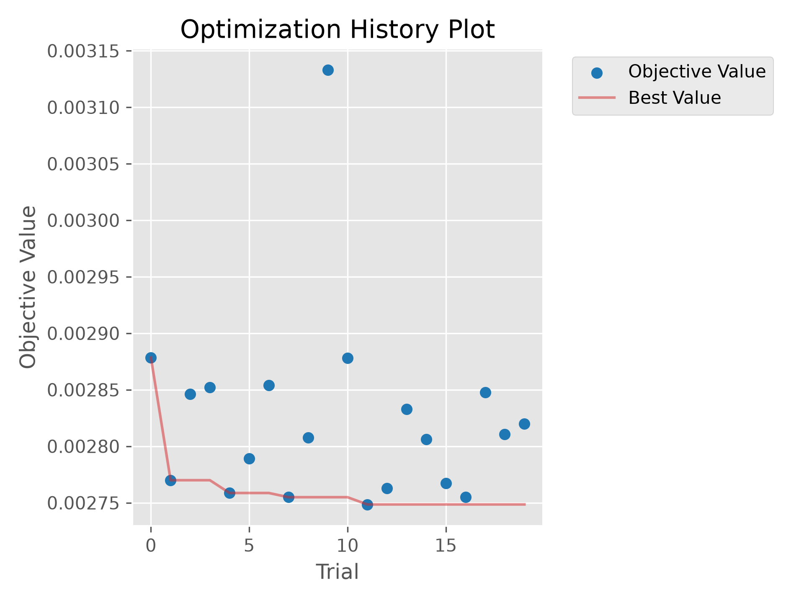

# Algorithmic Volatility Forecasting Engine

An automated machine learning pipeline built to predict 5-day rolling volatility on the S&P 500. This project demonstrates production-grade time-series forecasting, structural data leakage prevention, and automated hyperparameter tuning.

## Core Architecture

* **Data Pipeline:** Fetches 5 years of historical tick data via `yfinance`, computing log returns and generating lagged volatility matrices.
* **Structural Validation:** Implements a strict **Purged Cross-Validation** framework with a 5-day dead-zone gap to mathematically eliminate forward-looking data leakage during model training.
* **The Engine:** Utilizes an **XGBoost** regressor, optimized dynamically using **Optuna Bayesian Optimization** to navigate the hyperparameter search space.

## Optimization Results

The model achieved a forward-tested Root Mean Squared Error (RMSE) of `~0.0027`. 

Below is the Bayesian optimization history, demonstrating the AI dynamically learning and minimizing the error rate across multiple trial generations:

## Technology Stack
* **Language:** Python 3.10+
* **Libraries:** `xgboost`, `optuna`, `pandas`, `numpy`, `yfinance`
